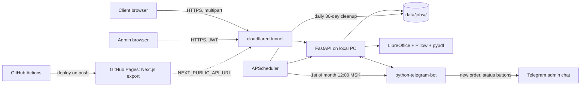

## Архитектура

Один процесс на ПК = бэкенд + бот + планировщик. Сайт собирается GH Actions и кладётся на Pages; URL туннеля передаётся в build через GitHub Secret.

## Структура репозитория

- `frontend/` — Next.js 15 (App Router, TypeScript, Tailwind), `output: 'export'` для статического билда.
- `backend/` — Python 3.11, FastAPI, python-telegram-bot v21, APScheduler, pypdf, Pillow, reportlab, LibreOffice (внешний бинарь).
- `.github/workflows/deploy-pages.yml` — сборка и деплой фронта на Pages.
- `README.md` — пошаговые инструкции.

## Frontend (Next.js, GitHub Pages)

Структура:
- `frontend/app/page.tsx` — главная: drag-and-drop загрузка, превью, удаление по крестику, расчёт стоимости, кнопка «Отправить», попап «ОК».
- `frontend/app/administrator/page.tsx` — форма логина (POST на бэкенд → JWT 30 дней в `localStorage`).
- `frontend/app/administrator/manager/page.tsx` — список папок (одна отправка = одна папка с именем `YYYY-MM-DD_HH-MM-SS`), множественный выбор, удаление, переход внутрь.
- `frontend/app/administrator/manager/[jobId]/page.tsx` — содержимое папки: список PDF, скачать поотдельности, скачать всё (ZIP).
- `frontend/components/Logo.tsx` — SVG: «A**v**antaPrint», `v` цвета `#FF0478`, остальные буквы `currentColor` (адаптируется под фон: чёрный/белый).
- `frontend/lib/validation.ts` — белый список расширений и MIME (`pdf, png, jpg, jpeg, gif, bmp, tiff, webp, heic, doc, docx, xls, xlsx, ppt, pptx, odt, ods, odp, rtf, txt`). Чёрный список явно опасных (`exe, bat, cmd, ps1, sh, vbs, msi, dll, scr, js, jar, lnk, com, reg`).
- `frontend/lib/pricing.ts` — тарифы и подсчёт. Цены в одном месте: чб A4 = 20, A3 = 40; цвет A4 = 50, A3 = 100. Переключатели «цветность» и «формат» на всю отправку (минимально достаточно, иначе UI разрастётся).
- `frontend/lib/api.ts` — клиент к `process.env.NEXT_PUBLIC_API_URL`.

Подсчёт страниц на клиенте:
- Для PDF — `pdfjs-dist` читает количество страниц.
- Для изображений — 1 страница.
- Для DOC/XLS/PPT — отображаем «≈1 стр., уточнится после загрузки» (точную цифру даст сервер; финальная сумма приходит в ответе и отображается в попапе «ОК»).

`frontend/next.config.mjs`: `output: 'export'`, `basePath` и `assetPrefix` под имя репозитория, `images.unoptimized: true`.

## Backend (Python, локально на ПК)

Файлы:
- `backend/app/main.py` — FastAPI app + lifespan: старт бота (`Application.run_polling` в фоновой задаче), старт `APScheduler`. CORS разрешает домен GH Pages.
- `backend/app/core/config.py` — `pydantic-settings`: `BOT_TOKEN`, `ADMIN_LOGIN=AvantaPrint`, `ADMIN_PASSWORD_HASH` (bcrypt от `AvantaGuccinPrint`), `JWT_SECRET`, `BOT_REGISTRATION_SECRET`, `DATA_DIR=./data`, `RETENTION_DAYS=30`, `TZ=Europe/Moscow`.
- `backend/app/core/security.py` — bcrypt + JWT (HS256, exp=30d), depends-функция для защиты эндпоинтов.
- `backend/app/core/storage.py` — структура папок:
  - `data/jobs/<job_id>/raw/` — оригиналы;
  - `data/jobs/<job_id>/print/<n>.pdf` — готовые к печати;
  - `data/db.json` (через `tinydb`) — список заказов: `id`, `created_at`, `files[{name, pages}]`, `total_rub`, `status`, `tg_message_id`.
- `backend/app/core/converter.py` — единая функция `to_a4_pdf(input_path) -> Path`:
  - изображения → reportlab/Pillow: страница A4 (210×297 мм, 300 dpi), картинка вписывается с сохранением пропорций; прямоугольная картинка ориентируется длинной стороной к длинной стороне A4 (auto-rotate);
  - офисные → `subprocess` LibreOffice headless: `soffice --headless --convert-to pdf --outdir ...`;
  - PDF → проходит через pypdf, страницы при необходимости масштабируются под A4.
- `backend/app/core/pricing.py` — серверный пересчёт суммы по числу страниц + опции из запроса.
- `backend/app/api/auth.py` — `POST /api/auth/login` ({login, password}) → `{token}`.
- `backend/app/api/upload.py` — `POST /api/upload` (multipart, `color`, `format`):
  1. валидация расширений/MIME, отбрасывание опасных;
  2. сохранение оригиналов;
  3. конвертация каждого файла в PDF и форматирование под A4;
  4. подсчёт страниц и суммы;
  5. запись в `db.json`;
  6. отправка боту (через очередь/прямой вызов) → сообщение админу;
  7. ответ `{job_id, files, total_pages, total_rub}`.
- `backend/app/api/admin.py` (защищено JWT):
  - `GET /api/folders` — список заказов;
  - `GET /api/folders/{id}` — содержимое;
  - `GET /api/folders/{id}/zip` — скачать всю папку архивом;
  - `GET /api/folders/{id}/files/{n}` — скачать один PDF;
  - `DELETE /api/folders` (массив id) — массовое удаление.
- `backend/app/scheduler.py` — APScheduler:
  - ежедневно в 03:00 удаляет заказы старше `RETENTION_DAYS`;
  - 1-го числа каждого месяца в 12:00 МСК вызывает `bot.stats.send_monthly_report()`.

## Telegram-бот (Python)

- `backend/app/bot/bot.py` — инициализация `Application(BOT_TOKEN)`. Регистрация `chat_id` админа: команда `/start <BOT_REGISTRATION_SECRET>` → сохраняет chat_id в `data/admin.json`. Все уведомления летят в этот chat_id.
- `backend/app/bot/handlers.py` — функция `notify_new_order(job)` посылает сообщение:
  - Текст: краткий список файлов с числом страниц, итоговая сумма.
  - Прогресс «Шаг 1/3 — Ожидание оплаты».
  - Inline-кнопка «Заказ оплачен» (`cb:order:<id>:next`) и «К прошлому этапу» (на 2-м и 3-м шаге).
- Колбэки на нажатия:
  - `awaiting_payment` → «Заказ напечатан» (Шаг 2/3 — Печать);
  - `printing` → «Реализовано» (Шаг 3/3 — Вручение);
  - `delivering` → «Готово» (заказ закрыт).
  - На каждом шаге кроме первого активна кнопка «К прошлому этапу».
  - Состояние пишется в `db.json`; сообщение редактируется через `edit_message_text` + `InlineKeyboardMarkup`.
- `backend/app/bot/stats.py` — собирает заказы за прошлый календарный месяц по часовому поясу `Europe/Moscow` и шлёт админу: всего заказов, сколько закрыто (`done`), сколько застряло на каждом этапе.

## GitHub Actions

`.github/workflows/deploy-pages.yml`:
- Триггер: push в `main` по пути `frontend/**`.
- Шаги: setup-node 20 → `npm ci` в `frontend/` → `next build` (env `NEXT_PUBLIC_API_URL` из секрета) → `actions/upload-pages-artifact` из `frontend/out` → `actions/deploy-pages`.
- Никаких задач для бота в Actions: бот целиком работает на вашем ПК (так вы и просили).

## Безопасность и нюансы

- Пароль не лежит в открытом виде; в `.env` бэкенда хранится bcrypt-хеш строки `AvantaGuccinPrint`. Логин жёстко `AvantaPrint`.
- JWT exp = 30 дней → пользователь не разлогинивается раньше срока.
- Bot Token не попадает в фронт: фронт его не знает. Только локальный бэкенд.
- На GH Pages в репо никаких секретов не утекает: `NEXT_PUBLIC_API_URL` — это публичный URL туннеля, его «секретность» не нужна.
- CORS на бэкенде разрешает только домен Pages.

## Что нужно будет сделать вам, чтобы всё запустилось

В `README.md` пошагово:

1. Создать публичный репозиторий на GitHub, запушить код, в Settings → Pages выбрать source «GitHub Actions».
2. В Settings → Secrets and variables → Actions добавить переменную `NEXT_PUBLIC_API_URL` со значением URL вашего cloudflared-туннеля (например, `https://avantaprint.example.trycloudflare.com`).
3. На своём ПК: установить Python 3.11+, LibreOffice, cloudflared.
4. Склонировать репо, создать `backend/.env` из `.env.example`, заполнить `BOT_TOKEN`, сгенерированные `JWT_SECRET` и `BOT_REGISTRATION_SECRET`.
5. `pip install -r backend/requirements.txt`.
6. Поднять туннель: `cloudflared tunnel --url http://localhost:8000` (или именованный с фиксированным URL — рекомендуется, чтобы не передеплоивать сайт).
7. Запустить сервис: `python -m app.main` (или `run.bat`). Это поднимет API + бота + планировщик одновременно.
8. В Telegram написать боту `/start <BOT_REGISTRATION_SECRET>` со своего аккаунта — бот запомнит ваш chat_id.
9. Открыть сайт по адресу `https://<username>.github.io/<repo>/`. Админка: `/<repo>/administrator`, логин `AvantaPrint`, пароль `AvantaGuccinPrint`.

После этого: пользователь грузит файлы → они летят на ваш ПК → конвертятся → бот уведомляет вас → админка показывает папку и даёт скачать.
